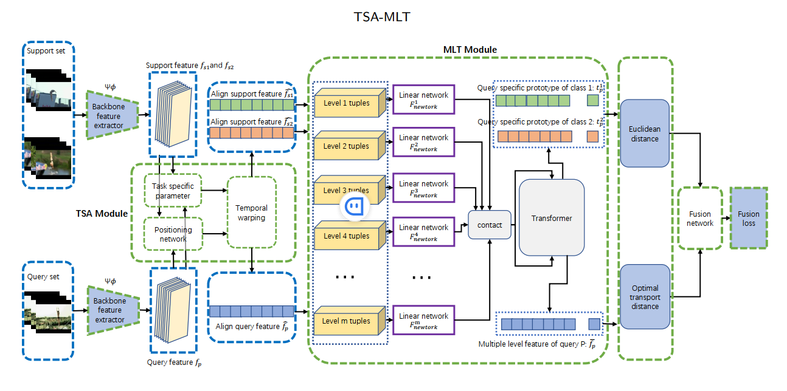

##  Task-Specific Alignment and Multiple-Level Transformer(TSA-MLT)

## Frame work of the paper

[Paper] (https://arxiv.org/abs/2307.01985)
        
This paper has been accepted by Neurocomputing.(https://doi.org/10.1016/j.neucom.2024.128044)

This repo contains code for the method introduced in the paper:
(https://github.com/cofly2014/TSA-MLT)

[Task-Specific Alignment and Multiple-level Transformer for Few-Shot Action Recognition]

## Where to download the dataset

##TODO

## How to configure the multiple level Segment Transformer
##TODO

## Splits
We used https://github.com/ffmpbgrnn/CMN for Kinetics and SSv2, which are provided by the authors of the authors of [CMN](https://openaccess.thecvf.com/content_ECCV_2018/papers/Linchao_Zhu_Compound_Memory_Networks_ECCV_2018_paper.pdf) (Zhu and Yang, ECCV 2018). We also used the split from [OTAM](https://openaccess.thecvf.com/content_CVPR_2020/papers/Cao_Few-Shot_Video_Classification_via_Temporal_Alignment_CVPR_2020_paper.pdf) (Cao et al. CVPR 2020) for SSv2, and splits from [ARN](https://www.ecva.net/papers/eccv_2020/papers_ECCV/papers/123500511.pdf) (Zhang et al. ECCV 2020) for HMDB and UCF.  These are all the in the splits folder.

## Citation
If you use this code/method or find it helpful, please cite:

## Acknowledgements

We based our code on [TRX  Temporal-Relational CrossTransformers for Few-Shot Action Recognition CVPR2021](https://github.com/tobyperrett/TRX) (logging, training, evaluation etc.). 
and the [TA2N: Two-Stage Action Alignment Network for Few-Shot Action Recognition AAAI2022](https://github.com/R00Kie-Liu/TA2N).(modify and improve the tmm)
and the 
We use [torch_videovision](https://github.com/hassony2/torch_videovision) for video transforms. 
We took inspiration from the image-based [CrossTransformer](https://proceedings.neurips.cc/paper/2020/file/fa28c6cdf8dd6f41a657c3d7caa5c709-Paper.pdf) 

